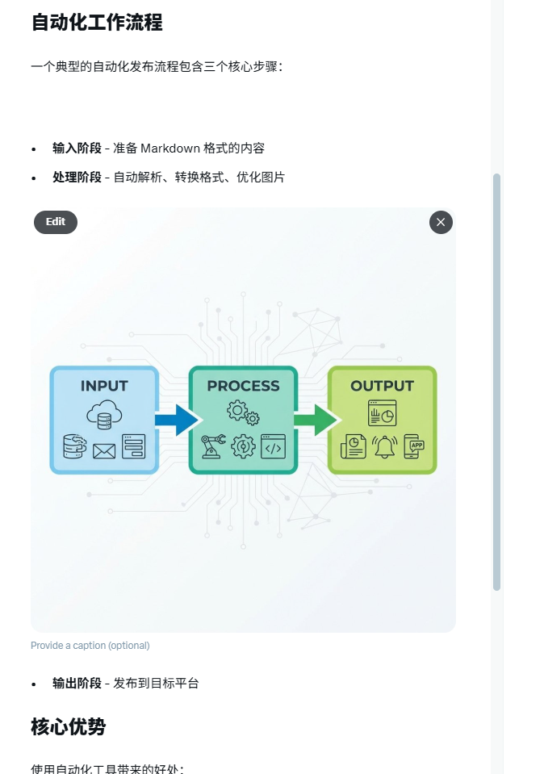
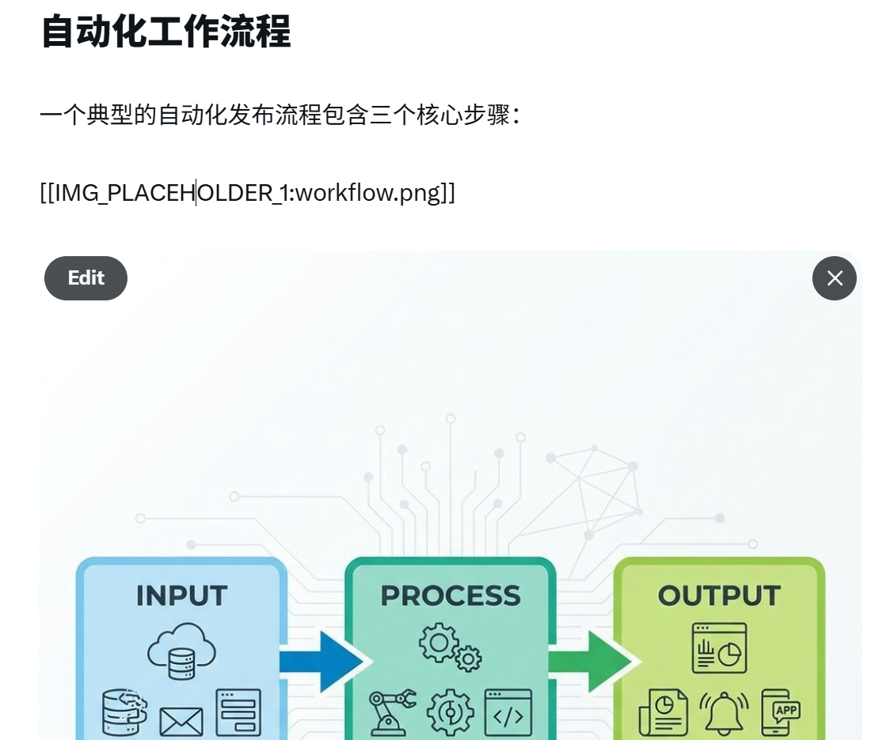

# AI 时代，什么工作不会被干掉？我的 3 个洞察

"AI 要取代我们了吗？"

朋友最近焦虑地问我这个问题。说实话，我也焦虑过。

去年我亲眼看着 AI 在 30 秒内写出比我花 2 小时写的周报还好的版本。那一刻，我的第一反应是：完了，我要失业了。🙅‍♀️

但后来发生了一些事，让我彻底改变了看法。

## 1. 转变：从"被替代"到"被放大"

先说个让我 Mind = blown 🤯 的经历。

我以前做一个数据报告要 4 小时：
- 收集数据 (1h)
- 整理格式 (1h)
- 写分析 (1h)
- 美化排版 (1h)

现在？我把原始数据丢给 AI，告诉它我要什么结论视角，15 分钟搞定。

**但重点来了**：省下的时间我干嘛了？

我用来思考更深的问题：这个数据背后说明了什么趋势？我们应该做什么调整？

看，AI 不是在"替代"我，而是在"放大"我。它干了我不想干的活，让我有时间干我真正擅长的事。

> 真正被替代的，不是"人"，而是"重复性工作"。✨

## 2. 三类工作的命运

经过这一年的观察，我发现工作可以分成三类：

**❌ 会被替代的：**
- 纯搬运型（复制粘贴、数据录入）
- 模式化创作（模板化文案、标准化设计）
- 信息检索型（简单问答、基础翻译）

**⚡ 会被增强的：**
- 创意工作（但需要+AI协作能力）
- 决策工作（但需要+数据解读能力）
- 沟通工作（但需要+AI辅助产出能力）

**🚀 会更吃香的：**
- 能提出好问题的人（Prompt Engineering 本质是提问能力）
- 能整合多种 AI 工具的人（Workflow 设计者）
- 能把 AI 输出变成实际价值的人（执行+落地）

## 3. 我的行动：成为"AI 原住民"

与其焦虑，不如行动。

我给自己定了一个原则：**任何重复超过 3 次的工作，先问问能不能让 AI 做。**

结果？

1. 周报？AI 写，我审核修改 —— 省 2 小时/周
2. 邮件回复？AI 起草，我调语气 —— 省 1 小时/天
3. 会议纪要？AI 总结，我补充决策 —— 省 30 分钟/次

这些省下来的时间，我用来学习更多 AI 工具，搭建更多自动化流程。

形成正循环。💡

> 未来不是"人 vs AI"，而是"不会用 AI 的人 vs 会用 AI 的人"。

## 结语

如果你现在还在焦虑 AI 会不会取代你，不如换个问题：

**"我怎么用 AI 让自己变得更强？"**

这才是正确的打开方式。

别只看，去试试！🚀

---

[@JackWison](https://x.com/jackaiwison)
