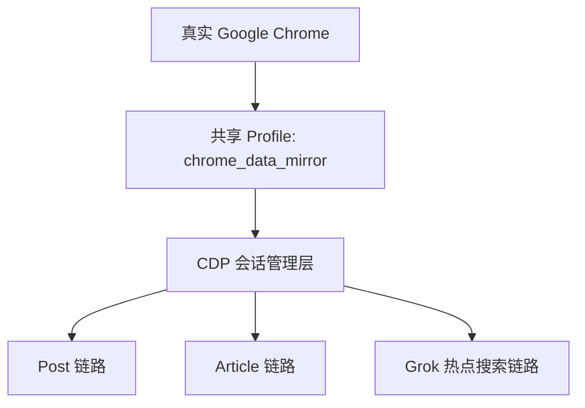
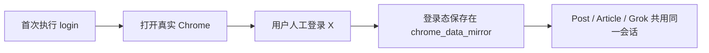

# PRD：Article 与 Grok 热点搜索链路迁移到真实 Chrome + CDP

**项目**: `gitxPost`  
**日期**: 2026-03-09  
**作者**: Codex  
**状态**: Draft  
**目标读者**: 产品、测试、研发、后续维护同事

## 1. 背景

当前项目里有 3 条和 X 浏览器自动化相关的链路：

- `Post` 短帖发布
- `Article` 长文发布
- `Grok 热点搜索`

其中，`Post` 已经迁移为：

- 真实 Google Chrome profile
- Patchright CDP 附着
- 首次人工登录，后续复用会话

而 `Article` 和 `Grok 热点搜索` 仍然基于：

- `undetected-chromedriver`
- `version_main` 依赖 Chrome 主版本
- 浏览器启动和登录态复用高度依赖 `create_driver()`

这会带来结构性风险：

1. Chrome 自动升级后，driver 容易失配
2. 浏览器启动和登录态容易不稳定
3. 修一个链路时，容易误伤另一个链路
4. 同一项目维护了两套浏览器控制路线，成本越来越高

这份 PRD 的目标是规划一条迁移路径，解决：

**“Chrome 一升级，老功能登录/启动就可能出问题”** 这个长期风险。

## 2. 要解决的问题

### 当前问题

#### 问题 1：Chrome 版本变化会直接影响启动成功率

当前 `Article` 和 `Grok` 都依赖 `undetected-chromedriver`。  
只要本机 Chrome 自动更新，就可能出现：

- 启动失败
- 会话不稳定
- 登录态丢失
- 脚本行为异常

#### 问题 2：登录态复用不够稳

现有老链路虽然也复用 `chrome_data_mirror`，但底层仍是 UC 驱动模型。  
一旦 driver、profile、Chrome 会话之间配合不好，就可能出现：

- 明明已经登录过，却掉回登录页
- 登录流程触发 X 风控
- 页面被识别成异常环境

#### 问题 3：3 条浏览器链路技术路线不一致

现在项目已经出现：

- `Post` 一套浏览器控制方案
- `Article` / `Grok` 另一套浏览器控制方案

这种状态短期可用，长期很难维护。

## 3. 产品目标

本次迁移后，希望达到以下效果：

1. `Article` 和 `Grok` 不再依赖 `chromedriver` 下载与版本匹配
2. 3 条链路统一复用真实 Chrome profile
3. 首次登录都采用“人工登录一次，后续复用”
4. Chrome 升级后，不需要频繁跟着修 `version_main`
5. 迁移过程中不破坏当前已经跑通的 `Post`

## 4. 非目标

这次迁移 **不解决** 以下问题：

1. 不接入 X 官方 API
2. 不做自动化登录绕过
3. 不承诺解决 X 平台本身的产品入口变化
4. 不重写 Markdown 解析、Prompt 生成、JSON 解析等业务逻辑

说明：

- 如果 `x.com/compose/articles` 本身变成 404 或权限受限，这是平台级问题，不是 driver 迁移本身能单独解决的
- 如果账号没有 Grok 权限，也不是迁移方案能解决的问题

## 5. 目标用户与核心场景

### 用户类型

- 内容创作者：发布 Article / Post
- 运营或研究人员：搜集 X 热点
- 维护同事：减少浏览器自动化故障

### 核心场景

#### 场景 A：长文发布

用户已经登录 X，希望用本地 Markdown 自动生成并发布 Article 草稿或正式发布。

#### 场景 B：Grok 热点搜索

用户已经登录 X 且有 Grok 权限，希望按主题和时间范围自动拉取热门帖子，并得到 JSON 输出。

#### 场景 C：Chrome 自动升级后继续可用

用户没有做任何额外修复，只是系统 Chrome 正常升级，希望工具仍然可以继续运行。

## 6. 方案选项

### 方案 A：继续维护 `undetected-chromedriver`

做法：

- 保留现有 UC 架构
- 增加 driver 下载缓存
- 增加版本兼容逻辑
- 出问题时继续补丁式修复

优点：

- 改动最少
- 对现有代码侵入较小

缺点：

- 不能从根本上解决 Chrome 升级风险
- 会持续反复遇到 driver/版本问题
- 仍然会保留两套浏览器架构

结论：

**不推荐。** 这只能延缓问题，不解决问题。

### 方案 B：将 `Article` 和 `Grok` 完全迁移到真实 Chrome + Patchright CDP

做法：

- 复用 `Post` 已验证的技术路线
- 真实 Chrome 负责浏览器会话
- Patchright 通过 CDP 连接并控制
- 所有链路统一复用同一个 profile

优点：

- 不依赖 `chromedriver`
- Chrome 升级风险明显降低
- 登录态复用更一致
- 三条链路的浏览器控制方式可逐步统一

缺点：

- 迁移量比方案 A 大
- `Article` 的编辑器交互需要重新适配
- `Grok` 的等待/提取逻辑需要改为 Playwright 风格

结论：

**推荐。** 这是本 PRD 的主方案。

### 方案 C：只迁移 `Grok`，`Article` 暂时保留 UC

做法：

- 先迁移 `Grok`
- `Article` 后续再看

优点：

- 风险更小
- 可以先拿一个低风险链路试点

缺点：

- `Article` 的结构性风险仍然存在
- 项目继续长期维持混合架构

结论：

可以作为阶段执行顺序，但不应作为最终方案。

## 7. 推荐方案

推荐采用：

**方案 B，分阶段落地。**

核心思路：

1. 抽取共享浏览器会话层
2. 先迁移 `Grok`
3. 再迁移 `Article`
4. 最后清理 `undetected-chromedriver` 相关依赖和说明

这样做的原因：

- `Post` 已经证明真实 Chrome + CDP 在本项目里可行
- `Grok` 相比 `Article` 的编辑器复杂度更低，适合先做迁移试点
- `Article` 最复杂，适合在共享会话层稳定后再迁

## 8. 目标架构

迁移后的理想结构：

### 浏览器控制层职责

共享浏览器会话层需要负责：

- 启动真实 Chrome
- 复用固定 profile
- 检测 CDP 端口
- 连接 Patchright
- 统一登录态检测
- 统一前台激活与锁文件清理

### 业务层职责

在会话层之上，各链路只负责自己的业务动作：

- `Post`：输入文本、上传图片、发布
- `Article`：输入标题、粘贴内容、插图、封面、发布
- `Grok`：打开 Grok、新建对话、发 prompt、等待 JSON、解析输出

## 9. 执行步骤

### Phase 0：抽共享浏览器层

目标：

- 把 `Post` 里已经验证可用的 Chrome + CDP 能力抽成公共模块

建议新增模块：

- `browser_cdp_session.py`

模块职责：

- 启动真实 Chrome
- 连接 Patchright
- profile 锁文件清理
- 端口检测
- profile 进程复用
- 登录态检测基础能力

验收标准：

- `Post` 改为依赖这个公共模块后，功能无回归

### Phase 1：迁移 Grok 热点搜索

目标：

- 去掉 `grok_hot_posts.py` 对 `undetected-chromedriver` 的依赖

做法：

1. 保留现有 prompt 构建逻辑
2. 保留现有 JSON 提取逻辑
3. 仅替换浏览器启动和页面交互层
4. 统一改为 Patchright CDP

重点动作：

- 打开 `https://x.com/i/grok`
- 复用共享 profile
- 检查 Grok 权限与登录态
- 新建对话
- 输入 prompt
- 等待回复完成
- 提取 JSON

验收标准：

- 在当前机器上，给定主题后能稳定输出 JSON
- 不再依赖 `version_main`
- Chrome 升级后无需改代码即可继续运行

### Phase 2：迁移 Article 长文发布

目标：

- 去掉 `auto_publish_uc.py` 对 `undetected-chromedriver` 的依赖

做法：

1. 保留 Markdown 解析逻辑
2. 保留剪贴板辅助逻辑
3. 替换浏览器控制层和页面交互层
4. 将编辑器交互改为 Patchright 风格

重点动作：

- 打开 Article 编辑入口
- 检查登录态
- 点击 `Write`（如需要）
- 输入标题
- 粘贴正文
- 上传内容图和封面图
- 草稿或发布

特别说明：

`Article` 是最复杂的一步，因为编辑器本身比 `Post` 更复杂，可能需要保留：

- 剪贴板粘贴
- JS 辅助定位
- 多选择器 fallback

验收标准：

- 草稿链路跑通
- 直接发布链路跑通
- 不再依赖 `version_main`

### Phase 3：统一 CLI 与登录入口

目标：

- 让三条浏览器链路共享同一套登录初始化方式

推荐做法：

- 新增通用命令：`xpost login`
- `post-login` 作为兼容别名保留一段时间

行为：

- 只打开真实 Chrome
- 让用户人工登录
- 复用同一个 profile

这样做后：

- `post`
- `article`
- `grok`

都可以共享同一个已登录环境。

### Phase 4：清理旧依赖和旧文档

目标：

- 删除 UC 专用说明和多余兼容逻辑

动作：

- README 更新
- `doctor` 输出更新
- 删除无用的 `version_main` 依赖说明
- 如果确认不再需要，移除 `undetected-chromedriver`

注意：

这一阶段只能在 `Article` 和 `Grok` 全都迁移完成后进行。

## 10. 功能流程图

### 统一登录模型

### Grok 迁移后流程

### Article 迁移后流程

## 11. 验收标准

### 功能验收

必须满足：

1. `Post` 无回归
2. `Grok` 在真实环境下可输出 JSON
3. `Article` 草稿可跑通
4. `Article` 发布可跑通

### 稳定性验收

必须满足：

1. Chrome 主版本变化后，不需要修改 `version_main`
2. 不再触发 runtime chromedriver 下载依赖
3. 登录态复用策略一致

### 文档验收

必须满足：

1. README 更新为统一架构说明
2. 登录方式说明统一
3. 迁移后的运行手册明确

## 12. 风险与缓解

### 风险 1：Article 入口本身不稳定

风险说明：

- `x.com/compose/articles` 可能出现 404、权限变化或入口调整

缓解策略：

- 在 PRD 中明确这属于平台风险
- 迁移时为入口设计 fallback
- 将“浏览器架构迁移”和“平台入口变化”分开处理

### 风险 2：Grok 页面结构变化

风险说明：

- Grok 按钮和消息区域可能变动

缓解策略：

- 保留多选择器匹配
- JSON 提取采用多级 fallback

### 风险 3：共享登录态导致相互影响

风险说明：

- 三条链路共享一个 profile，可能出现并发占用问题

缓解策略：

- 共享会话层统一做进程检测
- 严禁并发启动多个相同 profile 的独占实例

### 风险 4：迁移时误伤已跑通的 Post

风险说明：

- 共用基础模块后，`Post` 也可能被牵连

缓解策略：

- Phase 0 先让 `Post` 接入共享模块并验证
- 迁移 `Grok` 和 `Article` 时保持 `Post` 回归测试

## 13. 里程碑建议

建议按下面顺序推进：

1. `共享浏览器会话层`
2. `Grok 热点搜索迁移`
3. `Article 草稿迁移`
4. `Article 发布迁移`
5. `统一登录入口`
6. `README / doctor / 文档清理`

## 14. 最终结论

要解决 `Article` 和 `Grok` 的结构性风险，最合适的方式不是继续修 `undetected-chromedriver`，而是：

**把这两条老链路也迁移到“真实 Chrome profile + Patchright CDP”，并统一共享登录态与浏览器会话层。**

这条路线已经被 `Post` 链路验证过，在当前项目里是可行且值得复用的。
