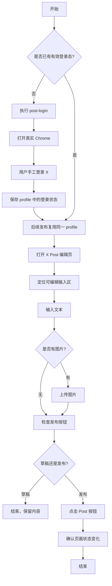
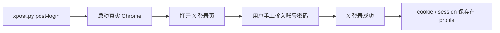

# X Post 功能实现总结

**项目**: `gitxPost`  
**日期**: 2026-03-09  
**适合对象**: 技术小白、产品、测试、后续维护同事

## 这次到底实现了什么

这次新增和跑通的是 X 的 `Post` 功能，也就是短内容发布，不是原来的 `Article` 长文发布。

当前已经真实验证通过的能力：

- 首次人工登录 X，并保存登录状态
- 复用已登录状态发送纯文本 Post
- 复用已登录状态发送图文 Post
- 支持草稿模式
- 支持直接发布模式

一句话理解：

**系统先借用你已经登录过的真实 Chrome，再自动帮你打开 X、输入内容、上传图片、点击发布。**

## 为什么不能直接“自动登录 + 自动发布”

因为 X 对登录环境的检查很严格。

如果用一个很“干净”的自动化浏览器去登录，哪怕账号密码是人工输入的，也可能被识别成异常环境，直接拒绝登录。

所以最终采用的是更稳的方案：

1. 第一次登录时，只打开真实 Google Chrome
2. 由你手工完成登录
3. 登录成功后，浏览器里的 cookie 和会话会保存在固定 profile 中
4. 后续发布时，脚本只复用这个已登录 profile，不再碰登录流程

这就是为什么现在流程稳定很多。

## 核心技术，用白话解释

### 1. 真实 Chrome Profile

可以把它理解成“浏览器的个人身份档案”。

里面保存了：

- 登录状态
- cookie
- 本地缓存
- 网站记住你的各种数据

这次 `post` 功能不是每次重新开一个全新的浏览器，而是复用这个固定 profile。  
这样 X 更容易把它当成“你平时就在用的浏览器”。

### 2. Patchright + CDP

它的作用不是“替代 Chrome”，而是“连接到已经打开的真实 Chrome，再远程控制它”。

可以把它理解成：

- Chrome 负责真实浏览网页
- Patchright 负责发控制指令

这样做的好处：

- 不依赖 `chromedriver`
- 不怕 Chrome 版本一变就挂
- 比起传统 Selenium + driver，稳定性更高

### 3. DraftEditor 输入框

X 的 Post 输入框不是普通文本框，而是比较复杂的网页编辑器。

这意味着不能简单理解成：

- 找到框
- 填字
- 点发送

真正要做的是：

- 找到真正可编辑的区域
- 让输入事件像正常打字一样生效
- 再确认发布按钮真的被激活

## 系统流程图

### 总流程



### 登录流程



### 图文发布流程


## 代码里最关键的几个文件

### `/Users/jackwl/Code/gitcode/gitxPost/xpost.py`

这是总入口。

它负责：

- 解析命令行参数
- 区分 `publish`（长文）和 `post`（短文）
- 调用 `post-login`
- 调用 `auto_publish_post.py`

### `/Users/jackwl/Code/gitcode/gitxPost/auto_publish_post.py`

这是这次 `post` 功能的核心实现。

它负责：

- 连接真实 Chrome
- 检查登录状态
- 打开 X Post 页面
- 输入文本
- 上传图片
- 点击发布按钮
- 处理草稿模式和可观察模式

### `/Users/jackwl/Code/gitcode/gitxPost/auto_publish_uc.py`

这是老的 `Article` 发布链路。

它主要负责：

- 长文 Article 发布
- 使用原来的 `undetected-chromedriver` 方案

这次目标是不要破坏它。

## 文字 Post 是怎么发出去的

流程可以理解成 5 步：

1. 打开 X 的 Post 页面
2. 扫描多个候选输入框
3. 选出真正可见、可编辑、未禁用的输入区域
4. 用接近真实输入的方式写入文本
5. 确认 `Post` 按钮已经可点击，再发布

这里最重要的不是“找到某个固定 DOM 节点”，而是：

- 多候选定位
- 可编辑性筛选
- 输入后再验证结果

## 图文 Post 是怎么发出去的

文字部分和上面一样，图片部分多了一步。

不是模拟点击系统文件选择框，而是直接找到网页里的隐藏上传控件：

- `input[data-testid="fileInput"]`

然后直接把图片文件传进去。

这样更稳，因为它避开了：

- macOS 文件选择器
- 焦点切换
- 弹窗同步问题

## 为什么加了“可观察模式”

你之前看到的是：

- 内容好像没输入
- 图片好像没插进去
- 页面一闪就结束了

但实际上帖子已经成功发出。

原因是：

- 自动化速度太快
- 脚本控制的页和你眼睛盯着的前台页不一定完全同步

所以后来加了：

- 把 Chrome 拉到前台
- `--observe-ms`

这样在输入后、上传后、发布前后会主动停一下，方便人眼确认。

## 当前这版方案的边界

当前已验证能用，但不是“无限稳定”。

还要记住这几个边界：

- 首次登录必须人工完成
- 当前重点验证的是单图，多图还应补专项测试
- 当前主入口是 `https://x.com/compose/post`
- 未来建议再补 `https://x.com/home` 的 fallback

## 推荐使用方式

### 第一次登录

```bash
source /Users/jackwl/Code/gitcode/gitxPost/.venv/bin/activate
python /Users/jackwl/Code/gitcode/gitxPost/xpost.py post-login
```

### 发纯文本

```bash
python /Users/jackwl/Code/gitcode/gitxPost/xpost.py post "Hello world" --publish
```

### 发图文

```bash
python /Users/jackwl/Code/gitcode/gitxPost/xpost.py post "这是一条图文 Post" \
  --images /path/to/image.png \
  --publish
```

### 调试时看清过程

```bash
python /Users/jackwl/Code/gitcode/gitxPost/xpost.py post "调试内容" \
  --images /path/to/image.png \
  --publish \
  --observe-ms 2500
```

## 最后一句总结

这次 `X Post` 能真正跑通，关键不是“浏览器自动化写得多复杂”，而是技术路线选对了：

**人工在真实 Chrome 里登录一次，后续只自动化已登录后的发布动作。**
