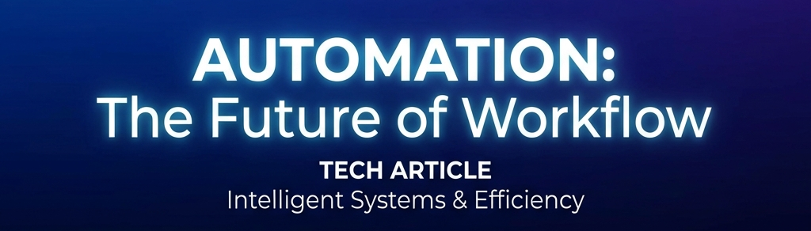
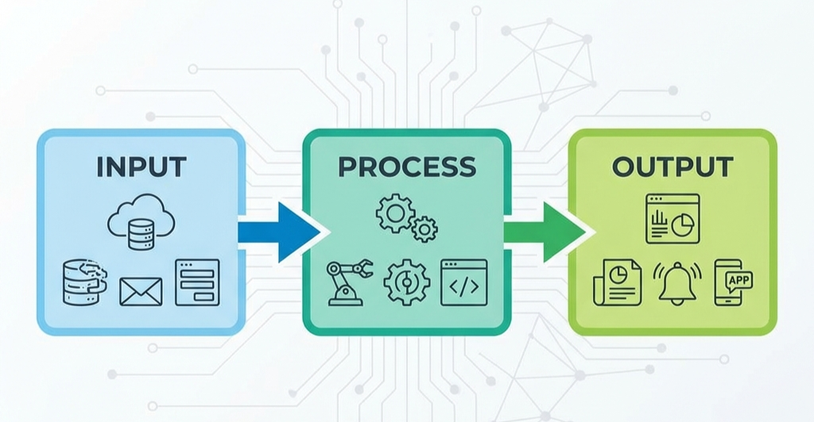
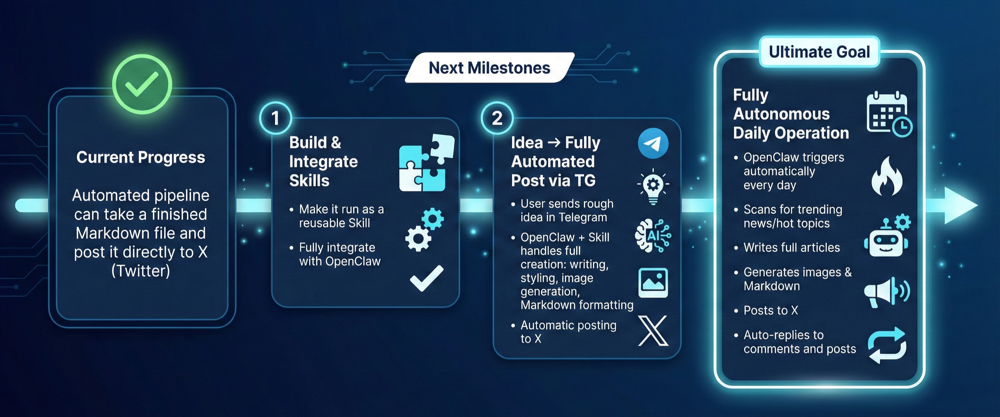

# Stop Wasting Your Fridays: How I Automated X Article Publishing in 30 Seconds 🚀

Writing a long-form article is hard enough. But formatting it for X? Manually uploading images one by one and praying the layout doesn't break? That's a true vibe killer. 🙅‍♀️

I used to spend 10-30 minutes every time I wanted to post. Copying, pasting, tweaking, uploading... repeat. No thanks. I don't even want to waste a single minute!!!

So I "Vibe Coded" a set of **Windows-native automation tools**. (I'm temporarily holding off on OpenClaw because of the cost, but I'll be bridging this to OpenClaw later for TG voice-command publishing). Now, I just finish my Markdown, run a script, and watch the magic happen. ✨

### The Pain: Paying the "Manual Tax"
The old workflow was a complete disaster:
- **Formatting Hell**: Converting Markdown to Rich Text while keeping bolds and links is pure torture.
- **Image Friction**: Clicking "upload" for every single screenshot and waiting for it to load is exhausting.
- **Efficiency Drain**: 10-30 minutes spent acting like a human copy-paste machine.

### The Solution: 1-Click Publishing 🤖
I combined **Playwright** with **Clipboard HTML magic** for a seamless publishing experience:

1. **Input**: Just write in the Markdown you know and love. (Future vision: AI will generate the MD and images based on your ideas and blogger persona).
2. **Execute**: One command, and the script takes over. (Coming soon: Just tell OpenClaw to do it via voice, anytime, anywhere).
3. **Done**: It auto-fills the title, pastes the content, and uses Markdown placeholders to precisely insert all images.

### The Result?
30 minutes of robotic work → **30 seconds**. 🤯
My life as a builder just got a whole lot easier. If you want to spend your time on actual creative work, automation is your "superpower."

### Next

**If you found this helpful, give it a like! 🚀**